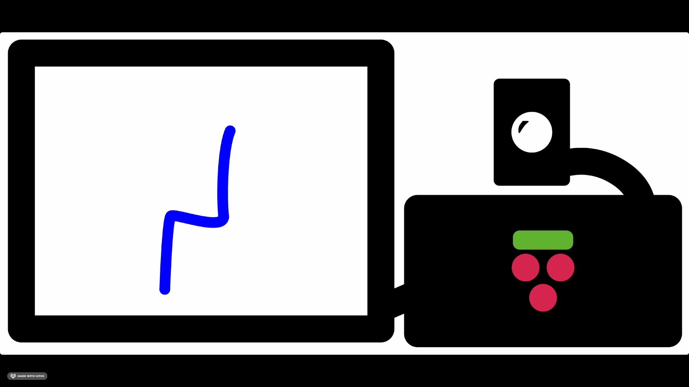

<!-- PROJECT LOGO -->
<br />
<p align="center">

  

  <h1 align="center">PosturePerfection</h1>

  <p align="center">
    Maintain a healthy posture as you work from home!
    <br />
    <a href="https://ese-peasy.github.io/PosturePerfection/"><strong>Explore the docs »</strong></a>
    <br />
    <br />
    <a href="https://github.com/ESE-Peasy/PosturePerfection">View Demo</a>
    ·
    <a href="https://github.com/ESE-Peasy/PosturePerfection/issues">Report Bug</a>
    ·
    <a href="https://github.com/ESE-Peasy/PosturePerfection/issues">Request Feature</a>
  </p>
</p>

<div align="center">


</div>

<!-- TABLE OF CONTENTS -->
<details open="open">
  <summary>Table of Contents</summary>
  <ol>
    <li>
      <a href="#about-the-project">About The Project</a>
      <ul>
        <li><a href="#components-used">Components Used</a></li>
        <li><a href="#built-with">Built With</a></li>
        <li><a href="#demonstration">Demonstration</a></li>
      </ul>
    </li>
    <li>
      <a href="#getting-started">Getting Started</a>
      <ul>
        <li><a href="#prerequisites">Prerequisites</a></li>
        <li><a href="#installation">Installation</a></li>
      </ul>
    </li>
    <li><a href="#usage">Usage</a></li>
    <li><a href="#roadmap">Roadmap</a></li>
    <li><a href="#contributing">Contributing</a></li>
    <li><a href="#license">License</a></li>
    <li><a href="#social-media-and-outreach">Social Media and Outreach</a></li>
    <li><a href="#contacts">Contact</a></li>
    <li><a href="#acknowledgements">Acknowledgements</a></li>
  </ol>
</details>

<!-- ABOUT THE PROJECT -->

## About The Project

We are a group of 5th Year Electronics & Software Engineering students at the University of Glasgow, completing a project which provides you with real-time notifications when we detect you have adopted a poor seated posture which could be detrimental to your future health. Check out our [website](https://ese-peasy.github.io/PosturePerfection/) for more information!

<div align="center">
  
</div>

### Components Used

- [TensorFlow Lite C++ API](https://www.tensorflow.org/lite/)
- [OpenCV C++ API](https://opencv.org)
- [QT C++ API](https://www.qt.io)
- [CppTimer](https://github.com/berndporr/cppTimer)
- [Simple Remote Notify Send](https://github.com/ESE-Peasy/simple-remote-notify-send)

### Built With

- GitHub Pages
- Doxygen
- CMake
- CTest

## Demonstration

Check out a demo of PosturePerfection below:

[](https://ese-peasy.github.io/PosturePerfection/#demonstration)

<!-- GETTING STARTED -->

## Quickstart

If you would like to download and run our project without any interest in development, simply use our provided script:

```sh
wget https://raw.githubusercontent.com/ESE-Peasy/PosturePerfection/main/PosturePerfection_install.sh
sh PosturePerfection_install.sh
```

**We have provided a short user manual [here](https://ese-peasy.github.io/PosturePerfection/instructions.html) that will guide you through usage of the application. Ths includes how to install the notification client, which you may want to run on a separate device.**

The installation currently only works on Linux machines. In particular, we test the software on the following:

- Intel x86 running Ubuntu 20.04 LTS
- Raspberry Pi 4B running Raspberry Pi OS

## Getting Started

To get PosturePerfection running by yourself you will need to follow these steps.

> **Note**: we recommend installing via the [quickstart](#quickstart) described above. Building from source involves downloading larger files and building TensorFlow Lite and OpenCV from source, a process that may take over an hour!

### Prerequisites

> All requirements will be installed if you follow the [installation](#installation) instructions below.

PosturePerfection uses the following tools and libraries:

- TensorFlow Lite
- OpenCV
- QT
- Boost Testing

### Installation

1. Clone the repo
   ```sh
   git clone https://github.com/ESE-Peasy/PosturePerfection.git
   ```
1. Run the install dependencies script (Note this may be a time consuming process as OpenCV must be built from source)
   ```sh
   cd PosturePerfection && ./scripts/install_dependencies.sh
   ```
1. Run the build script
   ```sh
   ./scripts/build.sh
   ```

<!-- USAGE EXAMPLES -->

## Usage

Start the application by running from the project root:

```sh
./PosturePerfection
```

## Testing

To build the project and run linting checks and the unit tests:

```sh
./scripts/build.sh -enable-testing
```

<!-- ROADMAP -->

## Roadmap

See the [open issues](https://github.com/ESE-Peasy/PosturePerfection/issues) for a list of proposed features (and known issues).

<!-- CONTRIBUTING -->

## Contributing

Contributions are what make the open source community such an amazing place to be learn, inspire, and create. Any contributions you make are **greatly appreciated**.

1. Fork the Project
2. Create your Feature Branch (`git checkout -b feature/AmazingFeature`)
3. Commit your Changes (`git commit -m 'Add some AmazingFeature'`)
4. Push to the Branch (`git push origin feature/AmazingFeature`)
5. Open a Pull Request

<!-- LICENSE -->

## License

Distributed under the GPL-3.0 License. See [`LICENSE`](https://github.com/ESE-Peasy/PosturePerfection/blob/main/LICENSE) for more information.

<!-- SOCIAL -->

## Social Media and Outreach

Follow our social channels to keep up to date with our branding and public outreach.

- [Twitter](https://twitter.com/PosturePerfect3)
- [Instagram](https://www.instagram.com/postureperfection1/)
- [Facebook](https://www.facebook.com/postureperfection1/)

<!-- CONTACT -->

## Contacts

This project is being completed by a team of 5th Year Engineering students at the University of Glasgow:

- [Andrew Ritchie](https://github.com/Andrew-Ritchie)
- [Ashwin Maliampurakal](https://github.com/Ashwin-MJ)
- [Conor Begley](https://github.com/C-Begley)
- [Miklas Riechmann](https://github.com/miklasr)

<!-- ACKNOWLEDGEMENTS -->

## Acknowledgements

- Using a pre-trained model with citation:
  ```
  @article{groos2020efficientpose,
    title={EfficientPose: Scalable single-person pose estimation},
    author={Groos, Daniel and Ramampiaro, Heri and Ihlen, Espen},
    journal={Applied intelligence},
    year={2020}
  }
  ```
- Uses the [TensorFlow](https://github.com/tensorflow/tensorflow) Lite C++ library
- Uses the [OpenCV](https://github.com/opencv/opencv) C++ library
