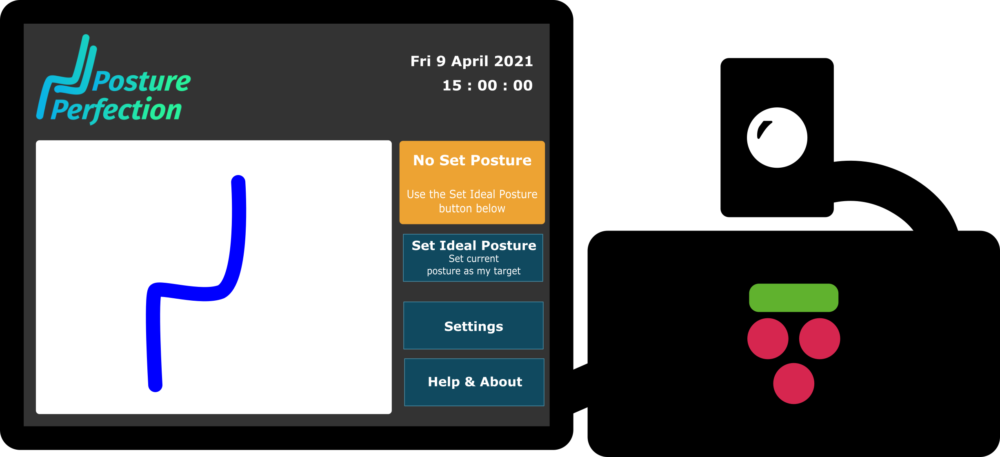
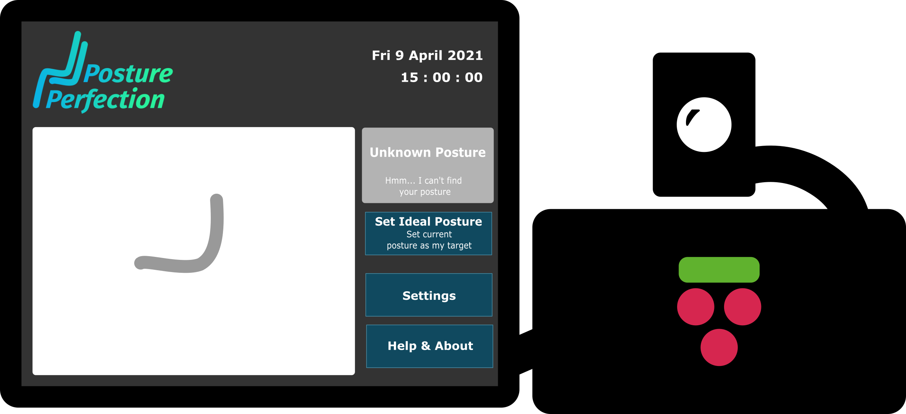
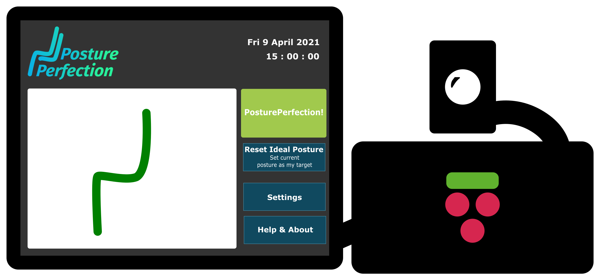
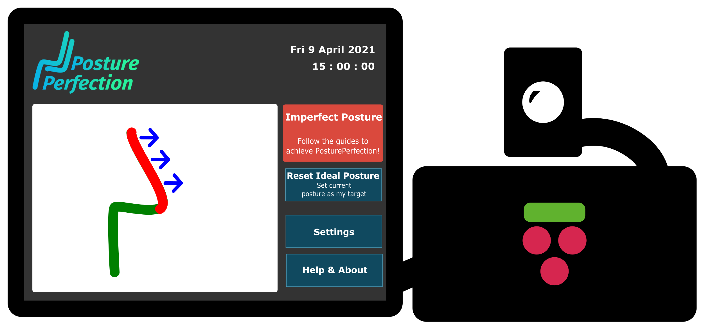
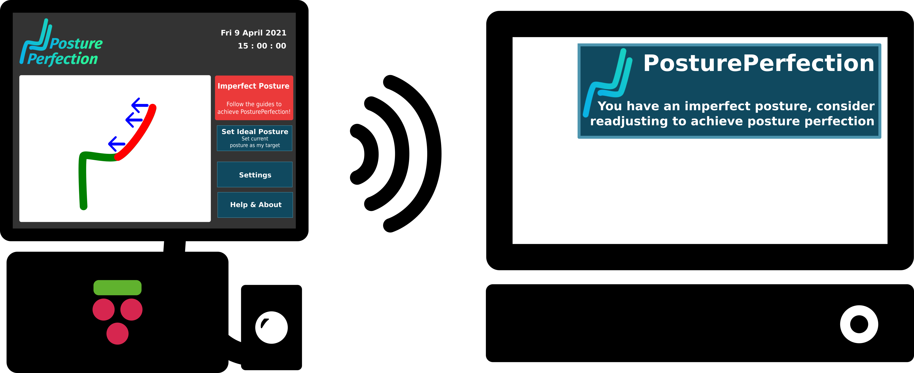

# Instructions

| Note for v1.0.0                                                                                                                                                                                                                                                                                                                                                                                                                                                                                                                                                                                         |
| :------------------------------------------------------------------------------------------------------------------------------------------------------------------------------------------------------------------------------------------------------------------------------------------------------------------------------------------------------------------------------------------------------------------------------------------------------------------------------------------------------------------------------------------------------------------------------------------------------ |
| _The below graphics are for illustration purposes only. The system has been configured to only use your upper body joints (Head, Neck, Shoulder and Hip) when analysing your posture. This was decided because we believe these are the joints which most significantly contribute to your seated posture, and requiring your whole body to be in frame makes it difficult to find a position to place your camera. Behind the scenes we still process the other body parts picked up via pose detection, and in a future release we hope to have this as an option you can configure in the Settings!_ |

## Set your Ideal Posture

PosturePerfection relies on you setting an "Ideal Posture" which is what the system refers to when determining if you have adopted a poor posture. Your detected posture is highlighted in Blue if you have not done this yet. To do so, simply adopt a good posture, ensure that the system can see you and click "Set Ideal Posture"!

    

We have identified some guides below for how you can go about deciding what is a ideal posture for you:

- [NHS - How to Sit Correctly](https://www.nhs.uk/live-well/healthy-body/how-to-sit-correctly/)
- [NHS - Common Posture Mistakes and Fixes](https://www.nhs.uk/live-well/exercise/common-posture-mistakes-and-fixes/)
- [NHS - Posture Tips for Laptop Users](https://www.nhs.uk/live-well/healthy-body/posture-tips-for-laptop-users/)

## "Unknown Posture" detected?

If pose estimation fails to detect your whole body, we bring this to your attention in the form of Grey lines - if you see this, please adjust your camera or your own positioning until you are clearly detectable in the video feed. In the Settings we have a slider for "Confidence Threshold" which you can tune to modify this - if you feel like you're being presented with an "Unknown Posture" even when you are in an optimal position, decrease this value a bit and that should improve your experience.

    

## Achieving PosturePerfection!

When you are happy with a posture that you have adopted and have clicked "Set Ideal Posture", your detected posture will be highlighted in Green as you are then in a position where you have achieved PosturePerfection! Carry on with your work, and the system will let you know when we detect you have strayed from this ideal posture. See below for more details to ensure you maximise your time in PosturePerfection!

    

## Realtime Guidance to PosturePerfection!

When we determine that your posture is no longer close to your ideal posture, arrows are drawn to guide you back to a better posture. Follow these arrows back to your perfect posture! We provide a configurable "Slouch Sensitivity" in the Settings. We have chosen a default value which worked well during development, but we are aware you might want to change this. Increase this if you would like the system to be more strict with you, such that minor movements from your ideal posture will be detected. However, if you would like the system to be a bit more lenient, feel free to decrease this value.

    

## Setting up Notifications

We are aware that some of you may choose to setup PosturePerfection on a separate device from your work device. Therefore, we have incorporated the sending of notifications from PosturePerfection to another Linux device on the same network when the system detects you have started slouching! Note that this isn't an exclusive feature - you can even receive these notifications on the same device on which you are running PosturePerfection!

To do this, ensure you have `simple-remote-notify-send` installed. Find the latest release and more information [here](https://github.com/ESE-Peasy/simple-remote-notify-send/releases/tag/v1.0.0). Run the `PosturePerfectionReceiver` on the device where you want to receive notifications, and then start `PosturePerfection`.

    

Notifications are delivered:

- When starting PosturePerfection
- When a Bad posture is detected for 10 seconds
- When an Unknown posture is detected for 5 minutes (so that you don't get spammed if you leave your desk!)
- When PosturePerfection is stopped
