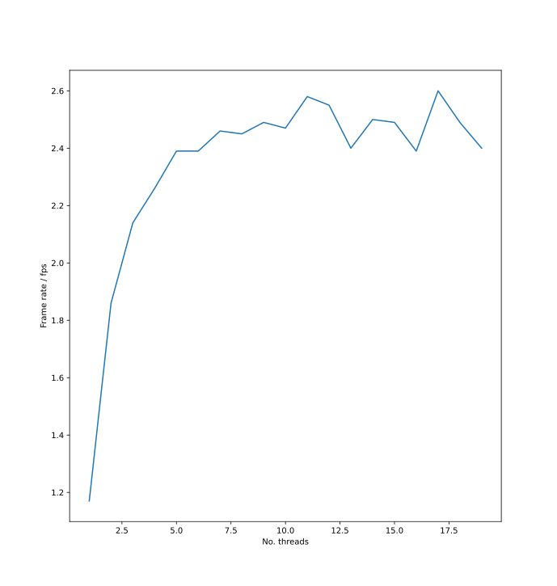
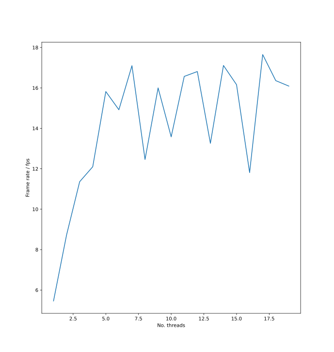

# Realtime Responsiveness Evaluation

A detailed description of the pipeline used in PosturePerfection is outlined [here](html/index.html). As a high level overview, the `FrameGenerator` runs in its own thread and makes use of a `CppTimer` to continually read frames from the camera feed into the system at regular intervals. The system then makes use of multithreading as several threads are initialised to pre-process the image and run pose estimation on it. Whenever the `FrameGenerator` timer fires, it notifies these threads that a new frame is ready for processing. If one of these threads is free, it performs the required pre-processing and pose estimation on that frame before passing it along with the results to the post processing thread. The post processing thread must process frames in order as `IIR` filtering is applied, before running the `PostureEstimator`. The `PostureEstimator` determines if the current frame includes the user in a good posture, and any changes they need to make to return to a good posture.

## Latency Evaluation

An important aspect of a real-time application like PosturePerfection is the latency of the pipeline. We define this to be the time it takes for a frame to be received from the `FrameGenerator` to the internal callback to update the GUI having completed. This latency reflects the delay a user would notice from performing an action and this being reflected in the PosturePerfection output. An ideal system would have a latency of zero as this would feel like looking in a mirror for the user. When deciding on the maximum acceptable latency the most critical use-case is when a user attempts to readjust their posture after having been notified that their posture has deteriorated. When a user is using the system in this way it is expected that they will want to make small/slow adjustments until they match the ideal posture. To this end we have decided that a latency of up to one second is acceptable.

An evaluation of the pipeline latency with a single `InferenceCore` thread (see [below](#frame-rate-improvement-by-using-multi-threading)) revealed a ~180ms latency when running on a laptop and ~890ms latency on the Raspberry Pi 4B. These figures match the requirements we have set out for the system. They also indicate that users who have more stringent performance requirements should use PosturePerfection on laptop or desktop machines as opposed to low-power single-board computers like the Raspberry Pi.

## Frame Rate Improvement by using Multi-threading

Operating all stages of the pipeline will yields poor performance as each stage is forced to wait until processing from the previous stage is completed. An inspection of execution times for the individual pipeline stages reveals the major bottleneck of the system to be the `InferenceCore`, which takes hundreds of milliseconds to execute for a single frame. It makes sense, therefore, to split this stage into a separate thread to allow other stages to run concurrently. In our pipeline we have opted for this approach, with the three stages (frame-capture, inference, interpretation of results) running in separate threads. We have an added requirement for the system that frames must be passed from one stage to the next in order. This has two reasons: 1. the output should be in order, 2. internal processing (including the IIR filter) requires frames in-order fro outcomes to be sensible.

We have conducted a simple experiment to determine how many threads running the `InferenceCore` should be running in our pipeline. This has been run on a laptop and Raspberry Pi 4B, with results shown below:

**Raspberry Pi**

**Laptop**

Based on these plots, it makes sense run multiple of these `InferenceCore` threads, with a significant improvement between one and five threads running. More advanced users may be interested in trying out different numbers for these threads themselves. Currently this can be changed using the `NUM_INF_CORE_THREADS` macro in `main.cpp`. Note that this number does not represent the total number of threads running, but only the number of `InferenceCore` threads.
