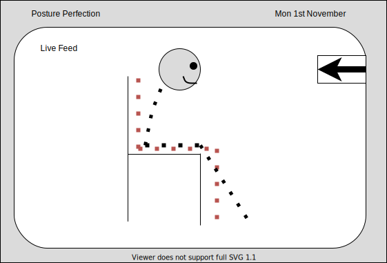

# Wireframes

## Initial Concepts
The following wireframes have been created as initial concepts during development, it is important to note that these represent the design ideas and not the exact user interface. Therefore, these are used as a design reference during the development of the application.

### Main Page
The main page will have a constant live feed displaying information relating to their exact posture.

 
  

### Live feed
The user can choose to expand the live feed. This larger display will also be used when the user is prompted to readjust their posture.

 
  

### Data  Page
Pages that don't show the live feed can show live data as a replacement.  This provides an alternative for users that may not want to see the live feed all of the time.

 
  

