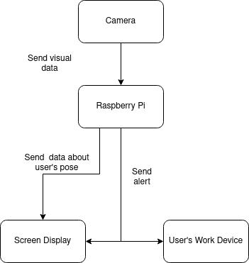
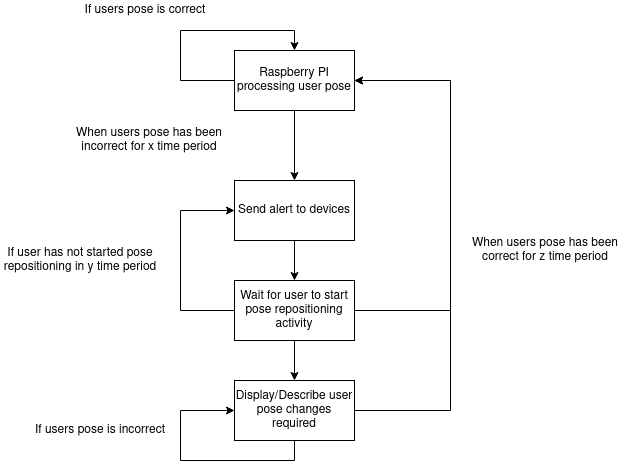

# System Diagram

# System Description
## Camera
The camera provides visual information of the user to the Raspberry Pi. The team has chosen the Raspberry Pi camera for ease of use, but any camera suitable for use with the Pi should be a valid option. The camera will be placed side on, so that the side profile of the users pose can be seen. 

## Raspberry Pi
The Raspberry Pi will handle all processing of the incoming images. The team has currently chosen to use the Pi 4 4GB and 8GB models, but further research may be done on older models if times permits. The Raspberry Pi will either use a trained neueral network model or computer vision depending on limitations discovered during the project. Real Time considerations will have to be made, so the user can have live feedback on their pose.

## Screen
This will provide a live update of the user's current pose, using the data generate from the Raspberry Pi. A notification will be displayed whenever the user's pose has been bad for a given time period. They will provided with onscreen real time feedback to show what they have to correct to improve their pose. As they attempt to change their posture, this changes will be processed by the Raspberry Pi in real time and new suggestions will be given, if the user is still not in a correct pose.

## User's Work Device
Alonside the screen notification, furhter notifications will be sent to the user's main computer device e.g Desktop PC, Laptop etc. This may be in the form of an email or a desktop client also running on the device. 

# Software Systems Interactions

# UML Diagrams

Coming Soon!
{: .label .label-yellow}

