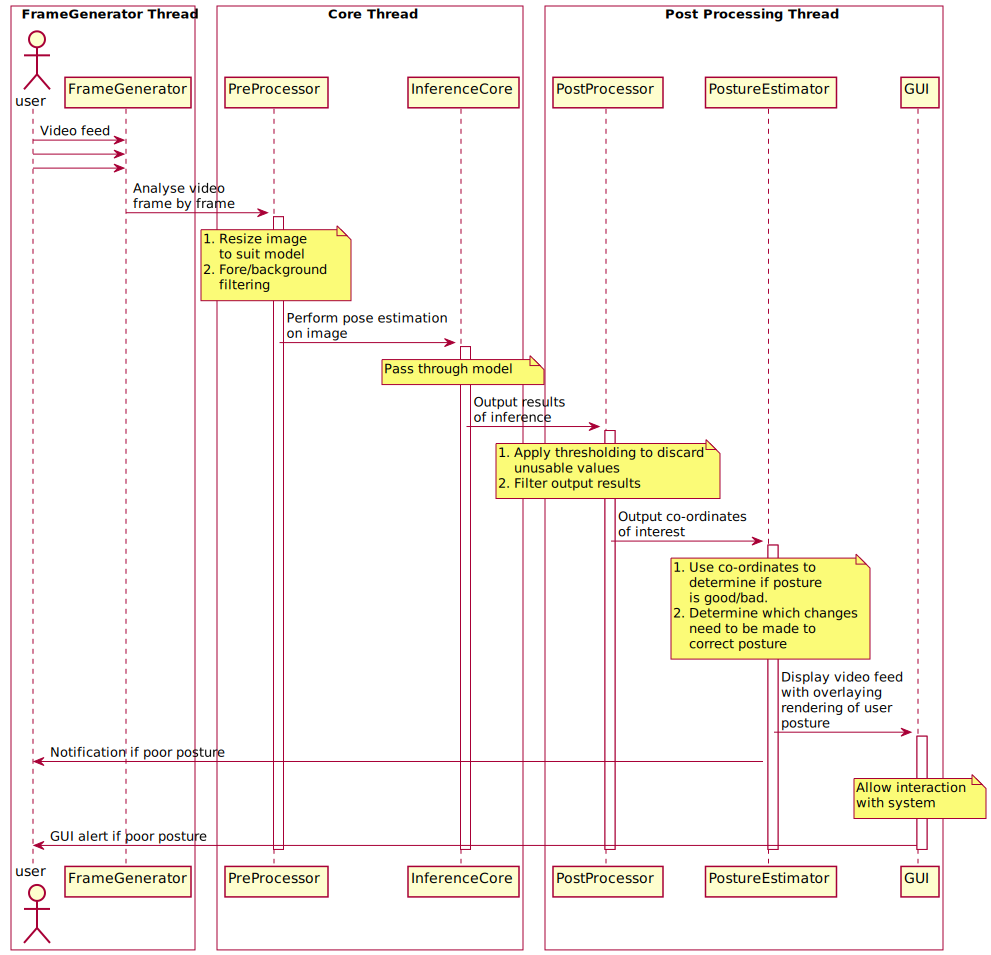

# Sequence Diagram

To more easily understand the exact process of analysing the video input and performing pose estimation on it, the following sequence diagram was created:
{: .fs-6 .fw-300 }

The system is separated into six main components:

## 1. `PiCamera`

An input video stream must first be obtained which allows frames to be passed through the system. This is done using [OpenCV](https://docs.opencv.org/3.4/d8/dfe/classcv_1_1VideoCapture.html) and individual individual frames are passed to the `Core Thread`.

## 2. `PreProcessor`

The `PreProcessor` is responsible for performing some initial processing on each frame of the video stream as it comes in. The image needs to be resized and normalised to suit the model being used in the `InferenceCore`, however it is also possible that some further filtering can be completed to improve the performance of the pose estimation model. This could be filtering the image to discard sections which are not of interest, such as the background of the picture.

[PreProcessor Documentation](../html/classPreProcessing_1_1PreProcessor.html){: .btn .btn-green}

## 3. `InferenceCore`

The `InferenceCore` is the heart of the system, and is responsible for performing pose estimation on the input image. Various models are likely to be used for this during the trialling phases, and so the component should be designed to allow the choice of model to be modified relatively easily. The system will then utilise [TensorFlow Lite](https://www.tensorflow.org/lite/) to perform the pose estimation, and structure the output results in a suitable format. The output is expected to be the co-ordinates and confidence value of the points of interest detected during pose estimation relative to the input image. These co-ordinates and confidence values are then passed to the `PostProcessing Thread`.

[InferenceCore Documentation](../html/classInference_1_1InferenceCore.html){: .btn .btn-green}

## 4. `PostProcessor`

The input co-ordinates to the `PostProcessor` from the `InferenceCore` will be relative, and therefore can be used directly with the initial input image from the `PiCamera`. This component is then responsible for analysing the confidence level of the various points detected and performing some thresholding to discard values which are not deemed to be confident enough, and other points which may not be of interest. Here, we also make use of `IIR Filters` to ensure that lines drawn to indicate posture in a later stage move smoothly with the video feed. The final co-ordinates of interest are then output from this component to the `PostureEstimator`.

[PostProcessor Documentation](../html/classPostProcessing_1_1PostProcessor.html){: .btn .btn-green}

## 5. `PostureEstimator`

The `PostureEstimator` is then responsible for using the co-ordinates received to determine if the user's posture is healthy or not when comparing to the ideal posture. If a poor posture is detected, this should be immediately brought to the user's attention on the `Graphical User Interface` and an additional alert may be sent from this unit directly to the user's work device if configured. The image frame is then overlayed with the detected posture at this stage. The detected posture may be in one of 4 states (see [this](../system/system-design.html#software-systems-interactions) diagram for more information):

- `Unset`: This is if the ideal posture has not been set by the user
- `Good`: This is if the current posture remains within a specified threshold of the ideal posture (this is user configurable in `Settings` via the _"Slouch Sensitivity"_ slider)
- `Undefined`: This is if pose estimation resulted in no joints being detected with a high enough degree of confidence (this is user configurable in `Settings` via the _"Confidence Threshold"_ slider)
- `Bad`: This is if the current posture is outwith the specified threshold of the ideal posture. In this case, lines are drawn to indicate the changes required to return to an ideal posture.

The overlayed image is then sent to the `Graphical User Interface` to allow a visual representation of the real-time processing to be displayed.

[PostureEstimator Documentation](../html/classPostureEstimating_1_1PostureEstimator.html){: .btn .btn-green}

## 5. `GraphicalUserInterface`

The `GUI` is responsible for displaying the overlayed image from the `PostureEstimator` and therefore providing a live feed of the user's posture. An alert label indicates the current posture, with an option continually provided to allow setting of the user's ideal posture. A `Settings` page is also provided to allow configuration of _"Slouch Sensitivity"_, _"Confidence Threshold"_ and _"Frame Rate"_, with pre-selected settings chosen based on our own testing.

[GUI Documentation](../html/namespaceGUI.html){: .btn .btn-green}
