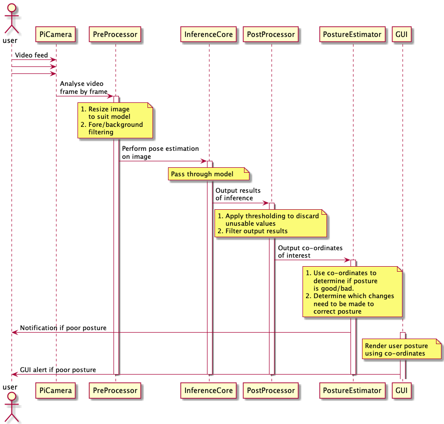

# Sequence Diagram

To more easily understand the exact process of analysing the video input and performing pose estimation on it, the following sequence diagram was created:

The system is separated into five main components:

## 1. `PiCamera`

An input video stream must first be obtained which allows frames to be passed through the system. The initial focus will be to use [OpenCV](https://docs.opencv.org/3.4/d8/dfe/classcv_1_1VideoCapture.html) for capturing this video stream, before passing individual frames to the `PreProcessing` unit.

## 2. `PreProcessor`

The `PreProcessor` is responsible for performing some initial processing on each frame of the video stream as it comes in. At the very least, the image will need to be resized and normalised to suit the model being used in the `InferenceCore`, however it is also possible that some further filtering can be completed to improve the performance of the pose estimation model. This could be filtering the image to discard sections which are not of interest, such as the background of the picture.

[PreProcessor Documentation](../html/classPreProcessing_1_1PreProcessor.html){: .btn .btn-green}

## 3. `InferenceCore`

The `InferenceCore` is the heart of the system, and is responsible for performing pose estimation on the input image. Various models are likely to be used for this during the trialling phases, and so the component should be designed to allow the choice of model to be modified relatively easily. The system will then utilise [TensorFlow Lite](https://www.tensorflow.org/lite/) to perform the pose estimation, and structure the output results in a suitable format. The output is expected to be the co-ordinates and confidence value of the points of interest detected during pose estimation relative to the input image. These co-ordinates and confidence values are then passed to the `PostProcessor`.

[InferenceCore Documentation](../html/classInference_1_1InferenceCore.html){: .btn .btn-green}

## 4. `PostProcessor`

The input co-ordinates to the `PostProcessor` from the `InferenceCore` will be relative, and therefore can be used directly with the initial input image from the `PiCamera`. This component is then responsible for analyse the confidence level of the various points detected and performing some thresholding to discard values which are not deemed to be confident enough, and other points which may not be of interest. The final co-ordinates of interest are then output from this component to the `PostureEstimator`.

[PostProcessor Documentation](../html/classPostProcessing_1_1PostProcessor.html){: .btn .btn-green}

## 5. `PostureEstimator`

The `PostureEstimator` is then responsible for using the co-ordinates received to determine if the user's posture is healthy or not. If a poor posture is detected, this should be immediately brought to the user's attention on the `Graphical User Interface` and an additional alert may be sent from this unit directly to the user's work device if configured. The final output of this should be easily usable by the `Graphical User Interface` to allow a visual representation of the real-time processing to be displayed.

[PostureEstimator Documentation](../html/classPostureEstimating_1_1PostureEstimator.html){: .btn .btn-green}

## 5. `GraphicalUserInterface`

The `GUI` is responsible for utilising the incoming data from the `PostureEstimator` and displaying a live feed of the user's posture. It is likely other features will also be added to this unit, which will require further design and modification of the system.

[GUI Documentation](../html/namespaceGUI.html){: .btn .btn-green}
