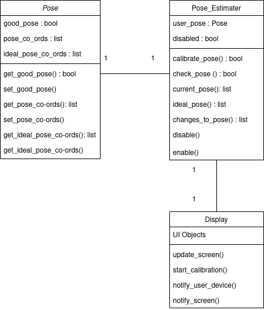

# System Diagram

# System Description

## Camera
The camera provides a live video stream of the user to the Raspberry Pi. The team has chosen the Raspberry Pi Camera V2 for ease of use, but any camera suitable for use with the Pi should be a valid option. The camera will be placed side on, so that the side profile of the user pose can be viewed. 

## Raspberry Pi
The Raspberry Pi will handle all processing of the incoming video feed. The team has currently chosen to use the 4GB and 8GB models of the Raspberry Pi Model 4B, but further research may be done on older models if times permits. The Raspberry Pi will make use of a trained neueral network model to perform pose estimation on the incoming video stream. Real-time considerations will have to be made so that pose correction feedback can be provided to the user.

## Screen
This will provide a live update of the user's current pose, using the data generated from the Raspberry Pi. A notification will be displayed whenever the user has adopted a poor posture for a given time period. The user will then be provided with real time feedback via this screen, to indicate the changes they must make to improve their posture. As they attempt to change their posture, these changes will be processed by the Raspberry Pi in real time until the user adopts a healthy posture.

## User's Work Device
Alongside the alert which is displayed on the dedicated screen for the device, configuration will allow further notifications to be sent to the user's main computer device e.g Desktop PC, Laptop etc. This may be in the form of an email or a desktop client running on the device. 

# Software Systems Interactions

# Inital UML Diagrams
As the software is still being researched, this is a representation of what roughly will be expected of the program

## Pose
This will be an object representation of the user's pose. There is a boolean, `good_pose`, denoting if the pose is good or bad, as per specific pose requirements e.g neck straight, shoulder over hips etc. There is also a list, `pose_co_ords`, which will contain the location of important pose points detected by the system. This may change depending on the pose identifying method. There is another list of co-ordinates that will represent the user's ideal pose, `ideal_pose_co_ords`.

## Pose_Estimater
This represents the neural network/computer vision handler that will be implemented. It will contain a `user_pose` object of the type `Pose` mentioned above, and a boolean for enabling/disabling the system. This class will handle processing images from the camera to identify the current user's pose, as well as calculating the ideal user's pose from the pre-calibrated pose. There is the option to disable/enable the pose estimation, giving the user a break etc.  

## Display
Further buttons detailed in the wire frames may need to be added as functions, depending how the project progresses. Similarly depending on the UI libraries etc used, the UI objects will be defined. The display class will handle updating the screen as well as starting calibration. There is then also the options for updating the user when their posture has become bad.  

